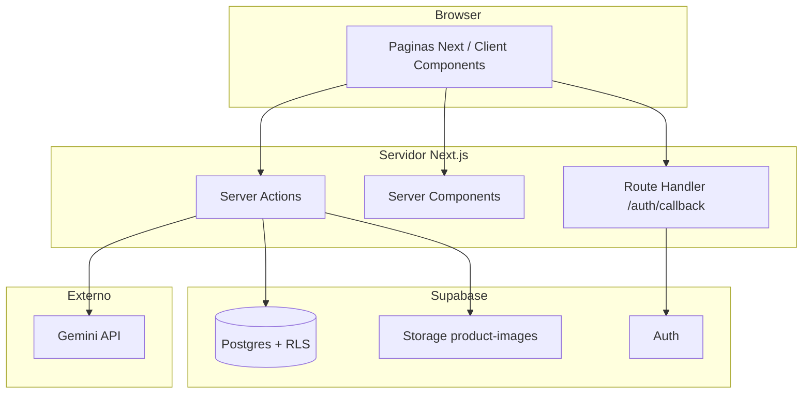
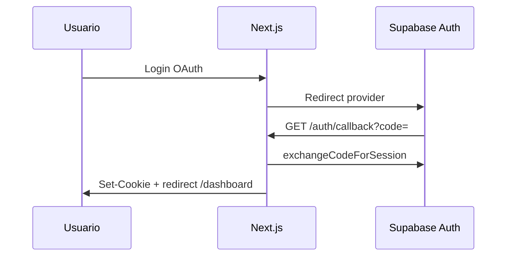
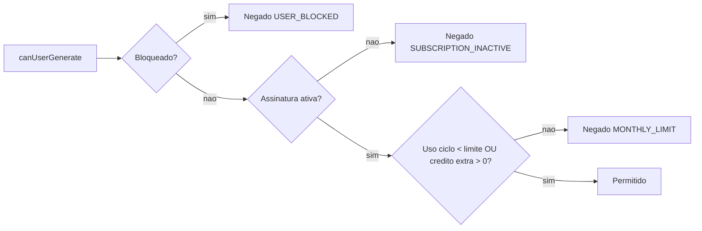

# Diagramas

## Visao em camadas

```mermaid
flowchart TB
  subgraph client [Browser]
    P[Paginas Next / Client Components]
  end
  subgraph next [Servidor Next.js]
    SA[Server Actions]
    RSC[Server Components]
    RH[Route Handler /auth/callback]
  end
  subgraph supa [Supabase]
    PG[(Postgres + RLS)]
    ST[Storage product-images]
    AU[Auth]
  end
  subgraph ext [Externo]
    GEM[Gemini API]
  end
  P --> SA
  P --> RSC
  P --> RH
  SA --> PG
  SA --> ST
  SA --> GEM
  RH --> AU
```

## Autenticacao (OAuth / PKCE)

```mermaid
sequenceDiagram
  participant U as Usuario
  participant N as Next.js
  participant S as Supabase Auth
  U->>N: Login OAuth
  N->>S: Redirect provider
  S->>N: GET /auth/callback?code=
  N->>S: exchangeCodeForSession
  N->>U: Set-Cookie + redirect /dashboard
```

## Gate de geracao

```mermaid
flowchart LR
  A[canUserGenerate] --> B{Bloqueado?}
  B -->|sim| X[Negado USER_BLOCKED]
  B -->|nao| C{Assinatura ativa?}
  C -->|nao| Y[Negado SUBSCRIPTION_INACTIVE]
  C -->|sim| D{Uso ciclo < limite OU credito extra > 0?}
  D -->|nao| Z[Negado MONTHLY_LIMIT]
  D -->|sim| OK[Permitido]
```

## Links

- [README arquitetura](./README.md)
- [App Router](./app-router-e-camadas.md)
