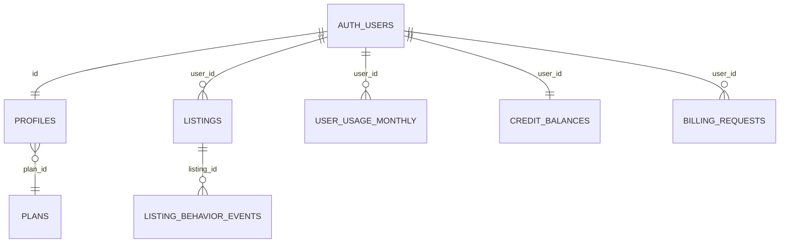

# Tabelas e relacoes

## Diagrama textual (Mermaid ER simplificado)

## `public.plans`

| Coluna | Tipo | Descricao |
|--------|------|-----------|
| id | text PK | `free`, `pro`, `business` |
| limits | jsonb | `monthlyGenerations`, `maxImagesPerGeneration`, `maxImageBytes`, `features` |
| active | bool | Planos visiveis em leituras publicas filtradas |

## `public.profiles`

| Coluna | Descricao |
|--------|-----------|
| id | FK `auth.users` |
| role | `user` \| `admin` |
| plan_id | FK `plans` |
| subscription_status | `active`, `inactive`, `expired`, `canceled` |
| billing_cycle_anchor_at | Inicio logico do ciclo de uso |
| free_tier_ends_at | Fim do trial free (30 dias apos cadastro) |
| billing_interval | `month` \| `year` \| null |
| blocked_at | Bloqueio administrativo |
| seller_segment, phone, company_name, ... | Cadastro |

## `public.listings`

Anuncio gerado: `outputs` JSON, `image_path`, `status` (`completed` \| `failed`), metadados de modelo.

Indices: `(user_id, created_at desc)`.

## `public.user_usage_monthly`

PK composta `(user_id, period)` onde `period` e chave ISO do **inicio do ciclo** (UTC).

## `public.credit_balances`

Saldo de creditos **extras** (nao expiram). Debito atomico via RPC.

## `public.billing_requests`

Fila manual: `kind` (`plan_subscribe` \| `credit_purchase` \| `support`), `status`, `payload` jsonb, `phone`.

## `public.listing_behavior_events`

Metricas pos-geracao (diff, tempos). FK listing + user.

## Storage `product-images`

Objetos com path `users/{userId}/...`; policies exigem match de `auth.uid()`.

## Links

- [Migrations](./migrations.md)
- [API RPCs](../api/catalogo-completo.md)
